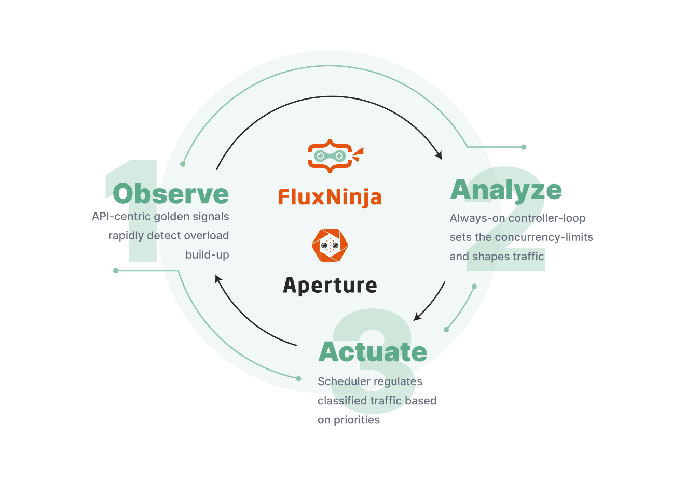

# Introduction

Welcome to official guide for Aperture open source! This guide is the best place
to start with Aperture. If you are ready, deploy Aperture locally with
[Aperture Learn tutorial](./get-started).

Aperture primarily provides "Flow Control as a Service" for modern cloud
applications, notably in web-scale applications. Aperture's adaptive flow
control policies are orders-of-magnitude effective in preventing cascading
failures and ensuring a consistent end-user experience than traditional
workflows and tools. Aperture's flow control policies include capabilities such
as distributed rate limiting (for abuse pervention) and concurrency limiting
(for service protection) to prevent cascading failures. The limits are applied
to the API traffic or features in the code to gracefully degrade the service in
overload scenarios and user abuse.

## How it Works

Policies configured in Aperture are always-on "Observe, Analyze, Actuate"
control-loops:

- Observe: Aperture has built-in, on-demand, telemetry collection system that is
  tuned towards control purposes. The telemetry collected by Aperture is very
  selective compared to traditional monitoring but it is higher-frequency and
  higher-fidelity. For instance, Aperture provides Traffic Classification rules
  that labels live traffic based on request payloads for telemetry and flow
  control purposes.
- Analyze: Aperture continuously tracks deviations from service-level objectives
  and automatically calculates recovery and escalation actions. To accomplish
  that, Aperture policies are expressed as signal processing graphs. The policy
  graph consumes telemetry signals, processing them through composable signal
  processing components such as arithmetic, conditional combinators, controllers
  (such as PID, Gradient) etc. The processed signals are fed into actuation
  components that perform flow control, auto-scaling (coming soon) and so on.
- Actuate: Aperture has actuation components such as concurrency limiters and
  rate limiters. These components together provide powerful flow control
  capabilities such as prioritized load-shedding, fairness and abuse prevention.

Please refer to the [Architecture section](./architecture.md) to understand
Aperture insertion.

### Observe

Reliability management at high-velocity and web-scale need large-scale data
collection/processing capabilities to auto-detect deviations from the
operational envelope and to progressively apply counter-measures defined in
escalation/recovery workflows.

Aperture implements custom-built observability pipeline that is geared towards
usage in control purposes. It's tuned differently from monitoring solutions that
are usually focused on root-cause analysis and alerting. Metrics have varying
cardinalities and frequency of change. Each of these metrics provides different
insights into each service and needs to be handled differently. Aperture plugin
or library enables telemetry data to be generated for all the API requests seen.
It also gathers high-cardinality Quality-of-experience signals to understand the
impact of overload (on users etc.) and to self-adjust the overload control
countermeasures.

Aperture also provides the ability to configure flow classification rules to
assign custom labels to incoming traffic flows at any control point(ingress,
egrees, feature). We introduce a concept of
[FluxMeter](./architecture.md#fluxmeter) that Correlates metrics from a
user-defined slice of traffic, defined by [selector](./architecture.md#selector)
on flow labels. This provides powerful insights to achieve infrastructure and
flow level visibility, helps identify the blast radius, and invokes flow control
policies allowing SREs to respond automatically to cascading failures.

Aperture's flexible observability components and control can dynamically
identify flows at the level of users, locations, [JWT tokens](https://jwt.io),
[URLs](https://en.wikipedia.org/wiki/URL), and so on by extracting fields of
interest from HTTP requests. This capability provides the ability to control the
traffic (e.g., rate limit, concurrency control, etc.) based on classification
key(s) in a prioritized manner. While assigning labels(classification key) to
values from a header or extracting a field from a JSON body, a tracing baggage
header is inserted. These classification headers are used for fine-grained
observability of flows and flow control.

### Analyze

The above telemetry data may also contain additional fields that are extracted
from the traffic (flow classification described above) but also gathered from
the code, traces/spans, or logs. These contain accurate results because they are
not sampled. These traces are aggregated within the Aperture agent and power the
dual-frequency of analyzing low-cardinality, high-frequency or high-cardinality,
and low-frequency metrics. High-cardinality, low-frequency metrics are sent to a
cloud service for long-term Quality of Experience (QoE) analytics and behavior
modeling. We preserve all service metadata and flow labels, so arbitrary metrics
may be created post-factum based on a user-defined selector. This feature is
only available through our FluxNinja Enterprise version
[Contact Us](mailto:sales@fluxninja.com) For purposes of control loop
evaluation, metrics are also stored in low-cardinality, high-frequency local
time series databases. Because of high frequency, these metrics need to be
predefined using the FluxMeter mechanism, which creates metrics for trace events
based on a selector. The selector includes the service, its control point (e.g.,
ingress), and also optionally a set of flow labels.

### Actuate

Aperture’s always-on control loop analyzes observability metrics, flow labels,
and service dependencies at various control points to detect cascading failures
in an application. By overlaying this data, Aperture determines the expected
desired concurrency required per label-based service level objective(SLO) by
continuously adjusting the load shed factor based on the incoming concurrency.
This in-depth analysis allows the policy circuit loop to detect overloaded
services and prevent SLO violations.
